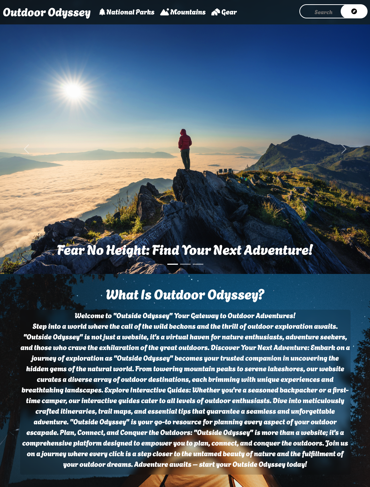
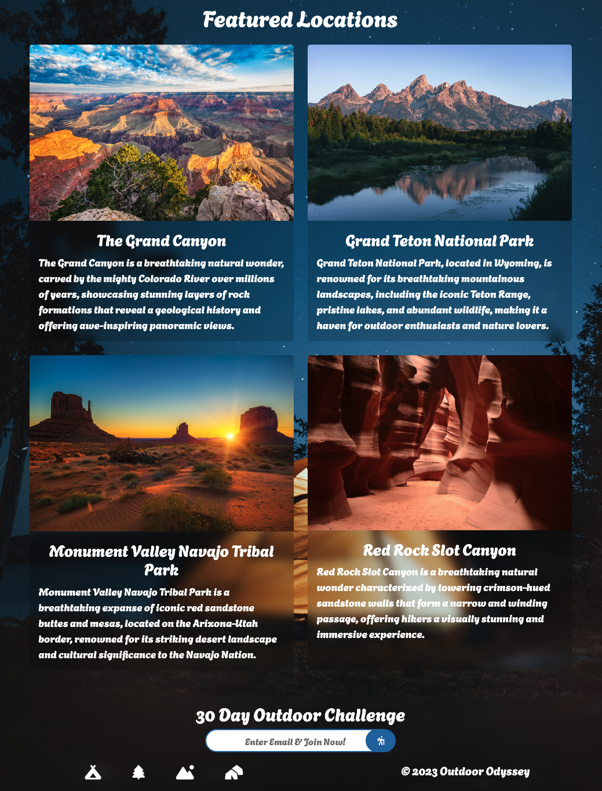
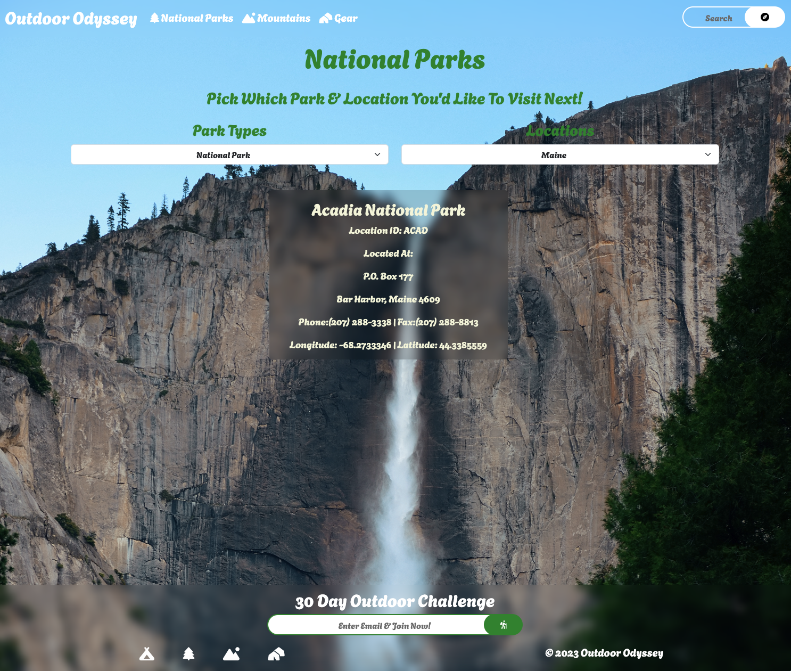
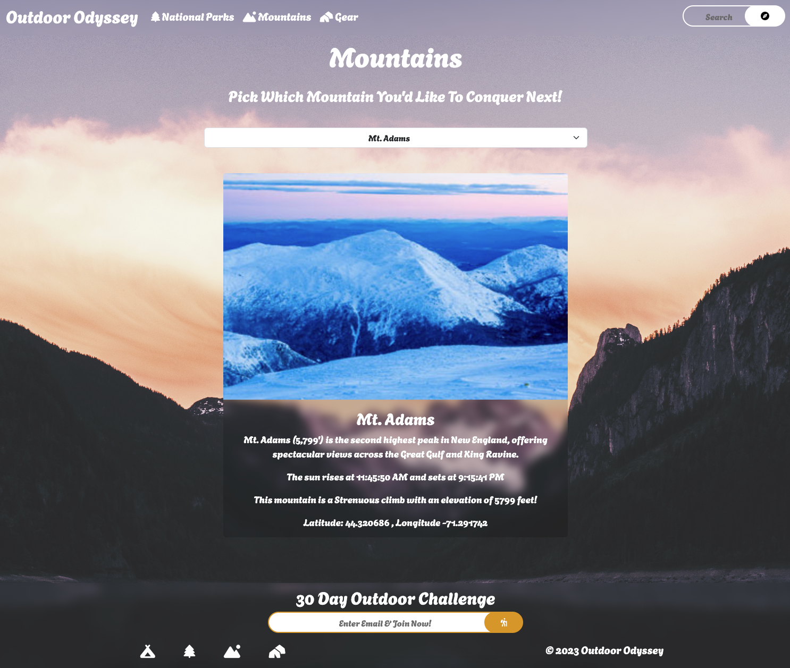

# Outside Odyssey
Your Gateway to Outdoor Adventures!
"Outside Odyssey" is not just a website, it's a virtual haven for nature enthusiasts, adventure seekers, and those who crave the exhilaration of the great outdoors

## Insight
- This is our second capstone where we used HTML, CSS, Bootstrap, & JavaScript to build a website where users can pick their next outdoor adventure! The goal of this capstone was to implement functional dropdowns and when an option is selected, to display that information to the users. 

## Interesting Piece
- In the parks page, I wanted to create a filter where the user can select both park type and location in the dropdown and it would fitler through the array to then display what the user has selected.

let array = nationalParksArray;

    if (parkTypeSelected && stateSelected){
        array = array.filter((nationalPark) =>
            nationalPark.State === stateSelected && nationalPark.LocationName.includes(parkTypeSelected)
        );
    }
    else if (parkTypeSelected){
        array = array.filter((nationalPark) =>
            nationalPark.LocationName.includes(parkTypeSelected)
        );
    }
    else if (stateSelected){
        array = array.filter((nationalPark) =>
        nationalPark.State === stateSelected
        );

## Outside Odyssey Home:

## Parks:

## Mountains:

